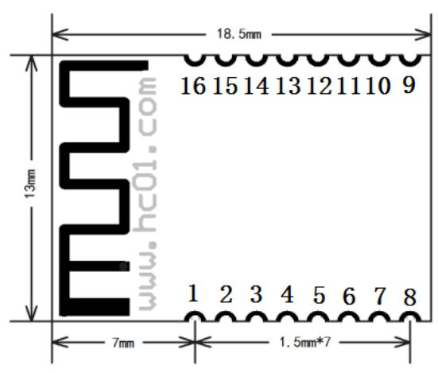
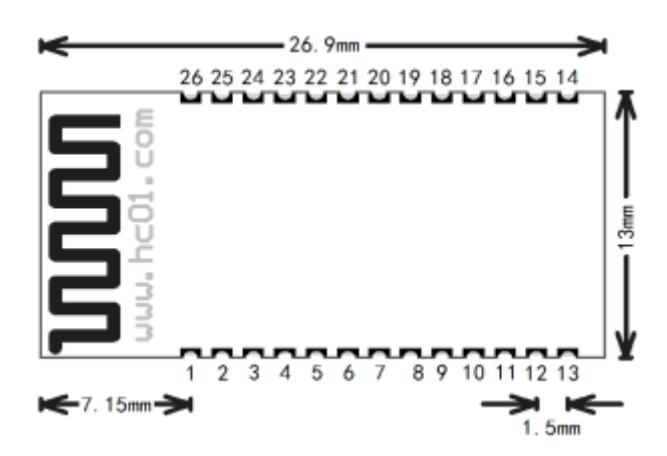
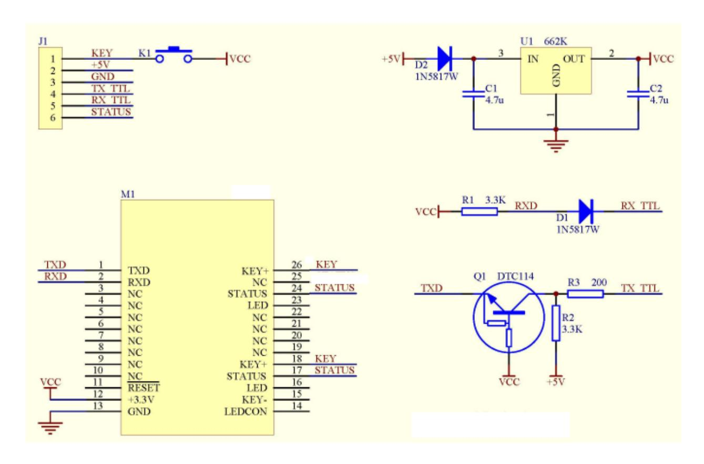

# HC-04 蓝牙串口通信模块 用户手册 V2.4

地址:广州市天河区科韵路天河软件园建工路 **19** 号 **608** 室

广州汇承信息科技有限公司

邮编:**510665**

电话:**020-84083341** 网址:www.hc01.com

### 版本信息

软件版本:HC-04 V2.4

# 发布日期

2022 年 3 月 31 日

# 修改记录

- 1. 修正 V2.0 固件版本 SPP 连接数据卡顿的 BUG。(2022 年 3 月 2 日)
- 2. 修正 BLE 传输大量数据卡死的 BUG。(2022 年 3 月 2 日)
- 3. 修复 V2.0 固件版本 AT+BTMODE 指令造成模块死机的 BUG。(2022 年 3 月 2 日)
- 4. 修正 V2.0 固件版本主机记忆出错的 BUG。(2022 年 3 月 2 日)
- 5. 增加小尺寸模块。(2022 年 3 月 2 日)
- 6. 改善 V2.2 版本 BLE 的通信速度和通信兼容性。(2022 年 3 月 31 日)

网址:www.hc01.com

地址:广州市天河区科韵路天河软件园建工路 19 号 608 室 第 1页

### 产品介绍

HC-04 蓝牙串口通信模块是新一代的基于 SPP&BLE5.0 蓝牙协议的双模数传模块。 无线工作频段为 2.4GHz ISM,调制方式是 GFSK。模块最大发射功率为 6dBm,接收灵 敏度为-92dBm。

模块采用邮票孔封装方式,可贴片焊接,模块有两种尺寸,标准尺寸模块型号为 HC-04,模块尺寸 26.9mm×13mm×2.7mm(带屏蔽罩);小尺寸模块型号为 HC-04S, 模块尺寸 18.5mm×13mm×1.7mm(不带屏蔽罩)。两种尺寸的模块很方便客户嵌入应用 系统之内。

# 小尺寸模块 HC-04S 尺寸和管脚定义:

HC-04S 模块共有 16 个引脚,板载 PCB 天线,引脚具体定义如下表:

| 引脚 | 定义    | 方向 I/O | 说明                                      |
|----|-------|-----------|-----------------------------------------|
| 1  | GND   |           | 模块公共地                                   |
| 2  | VCC   | 输入        | 电源脚,要求直流 电源,供电电流不小于 3.3V 100mA |
| 3  | TXD   | 输出        | 输出口,3.3V 电平 UART TTL           |
| 4  | RXD   | 输入,弱上拉    | 输入口,3.3V 电平 UART TTL           |
| 5  | NC    | 悬空        |                                         |
| 6  | NC    | 悬空        |                                         |
| 7  | NC    | 悬空        |                                         |
| 8  | NC    | 悬空        |                                         |
| 9  | STATE | 输出        | 模块连线状态指示输出脚(注②)                         |
| 10 | KEY+  | 输入,下拉     | AT 指令设置脚(注④)                         |
| 11 | LED   | 输出        | 模块工作状态指示灯输出脚(注①)                        |
| 12 | KEY-  | 输入,弱上拉    | AT 指令设置脚(注③)                         |
| 13 | NC    | 悬空        |                                         |
| 14 | NC    | 悬空        |                                         |
| 15 | NC    | 悬空        |                                         |
| 16 | RESET | 输入,弱上拉    | 模块复位脚,要求不小于 的低电平进行复位 100ms        |

网址:www.hc01.com

地址:广州市天河区科韵路天河软件园建工路 19 号 608 室 第 2页

#### 标准尺寸模块 **HC-04** 尺寸和管脚定义:

HC-04 模块共有 26 个引脚,板载 PCB 天线,引脚具体定义如下表:

| 引脚 | 定义     | I/O 方向 | 说明                                 |  |  |
|----|--------|-----------|------------------------------------|--|--|
| 1  | TXD    | 输出        | 输出口,3.3V 电平 URAT TTL      |  |  |
| 2  | RXD    | 输入        | 输入口,3.3V 电平 URAT TTL      |  |  |
| 3  | NC     | 悬空        | NC                                 |  |  |
| 4  | NC     | 悬空        | NC                                 |  |  |
| 5  | NC     | 悬空        | NC                                 |  |  |
| 6  | NC     | 悬空        | NC                                 |  |  |
| 7  | NC     | 悬空        | NC                                 |  |  |
| 8  | NC     | 悬空        | NC                                 |  |  |
| 9  | NC     | 悬空        | NC                                 |  |  |
| 10 | NC     | 悬空        | NC                                 |  |  |
| 11 | RESET  | 输入,弱上拉    | 模块复位脚,要求不小于 的低电平进行复位 100ms   |  |  |
| 12 | VCC    | 输入        | 电源脚,要求直流3.3V电源,供电电流不小于100mA        |  |  |
| 13 | GND    | 输入        | 模块公共地                              |  |  |
| 14 | LEDCON | 输入        | 板载 灯控制脚,接地关闭 灯 LED LED |  |  |
| 15 | KEY-   | 输入,弱上拉    | 指令设置脚(注③) AT                    |  |  |
| 16 | LED    | 输出        | 模块工作状态指示灯输出脚(注①)                   |  |  |
| 17 | STATE  | 输出        | 模块连线状态指示输出脚(注②)                    |  |  |
| 18 | KEY+   | 输入,下拉     | 指令设置脚(注④) AT                    |  |  |
| 19 | NC     | 悬空        | NC                                 |  |  |
| 20 | NC     | 悬空        | NC                                 |  |  |
| 21 | NC     | 悬空        | NC                                 |  |  |
| 22 | NC     | 悬空        | NC                                 |  |  |
| 23 | LED    | 输出        | 模块工作状态指示灯输出脚(注①)                   |  |  |
| 24 | STATUS | 输出        | 模块连线状态指示输出脚(注②)                    |  |  |
| 25 | NC     | 悬空        | NC                                 |  |  |
| 26 | KEY+   | 输入,下拉     | 指令设置脚(注④) AT                    |  |  |

网址:www.hc01.com

地址:广州市天河区科韵路天河软件园建工路 19 号 608 室 第 3页

注①:模块指示灯输出脚,高电平输出,接 LED 时请串接电阻。 作为从机:

连线前,LED 每 200ms 亮 100ms(快闪),偶尔会慢闪一下;

连线后,LED 常亮。

作为主机:

连线前,

主机未记录从机地址时,LED 每 200ms 亮 100ms(快闪),偶尔会慢闪一下; 主机有记录从机地址时,LED 每 1000ms 亮 500ms(慢闪);

连线后,LED 常亮。

- 注②:输出脚,模块连线状态指示。连线前输出高电平,连线后输出低电平。
- 注③:输入脚,内部弱上拉。在连线状态下,此脚接低电平,可以进入 AT 指令设置 模式;此脚接高电平(或者悬空),返回到串口透传模式。如果是主机,此脚 接低电平,模块先清除记忆,复位后再进入 AT 指令设置模式。
- 注④:输入脚,内部下拉。在连线状态下,此脚接高电平,可以进入 AT 指令设置模 式;此脚接低电平(或者悬空),返回到串口透传模式。如果是主机,此脚接 高电平,模块先清除记忆,复位后再进入 AT 指令设置模式。

### 电气特性:

| 参数   | 测试条件 |     | 参考值            |  |
|------|------|-----|----------------|--|
| 工作电压 | -    |     | DC3.0V~3.6V    |  |
|      | BLE  | 未连接 | 变化 5mA~20mA |  |
| 从机   |      | 已连接 | 约 7mA       |  |
| 工作电流 | SPP  | 未连接 | 变化 5mA~20mA |  |
|      |      | 已连接 | 约 9mA       |  |
|      |      | 未连接 | 约 28mA      |  |
| 主机   | BLE  | 已连接 | 约 7mA       |  |
| 工作电流 |      | 未连接 | 约 16.5mA    |  |
|      | SPP  | 已连接 | 约 6.5mA     |  |

# 模块参数设置 **AT** 指令

以下说明中,模块管脚均指 HC-04 标准尺寸模块的管脚,HC-04S 小尺寸的请自行对 应管脚位。

网址:www.hc01.com

地址:广州市天河区科韵路天河软件园建工路 19 号 608 室 第 4页

AT 指令用来设置模块的参数,模块在未连线状态下可以进行 AT 指令操作,连线后进 入串口透传模式。连线后,18 脚置高电平或 15 脚置低电平 100ms 后,也会进入 AT 指令 状态;18 脚置低电平(或者悬空)或 15 脚置高电平(或者悬空)100ms 后,会退出 AT 指令状态,返回透传状态。

模块启动大约需要 200ms,所以最好在模块上电 250ms 以后才进行 AT 指令操作。在 这 250mS 时间内,也不要往模块串口发送数据。除特殊说明外,AT 指令的参数设置立即 生效。同时,参数和功能的修改,掉电不会丢失。

AT 指令格式:由 AT+组成,结尾不用加回车换行。

# 默认出厂参数:

波特率 9600N81,SPP 蓝牙名 HC-04,BLE 蓝牙名 HC-04LE;SPP 配对密码 1234, BLE 没有配对密码。

# 一、通用指令(**SPP/BLE** 均生效)

# **1**、测试通讯

发送:AT 返回:OK

# **2**、改蓝牙串口通讯波特率和校验位

| 指令 | AT+BAUD=xx(或者 AT+BAUD=xx,y)               |  |  |
|----|----------------------------------------------|--|--|
| 返回 | OK+BAUD=9600                                 |  |  |
| 说明 | 串口设置,不带参数 就是保持之前的校验位。 y                |  |  |
| 详情 | 如下表所示,参数 xx、y 分别代表波特率、校验位。             |  |  |
|    | 发送:AT+BAUD=? 返回:OK+BAUD=9600,NONE         |  |  |
| 举例 | 发送:AT+BAUD=19200,E 返回:OK+BAUD=115200,EVEN |  |  |
|    | (并重启)(设置串口参数为:波特率 115200,偶校验)             |  |  |

### xx 是串口波特率代号,y 是校验位代号,如下表所示:

| 参数     | 串口波特率 xx    | 参数 | 校验位 y           |
|--------|----------------|----|--------------------|
| ?      | 查看当前波特率        |    |                    |
| 1200   | 1200bps        | N  | 无校验 NONE(出厂默认值) |
| 2400   | 2400bps        | E  | 偶校验 EVEN        |
| 4800   | 4800bps        | O  | 奇校验 ODD         |
| 9600   | 9600bps(出厂默认值) |    |                    |
| 19200  | 19200bps       |    |                    |
| 38400  | 38400bps       |    |                    |
| 57600  | 57600bps       |    |                    |
| 115200 | 115200bps      |    |                    |
| 230400 | 230400bps      |    |                    |
| 460800 | 460800bps      |    |                    |
| 921600 | 921600bps      |    |                    |

网址:www.hc01.com

地址:广州市天河区科韵路天河软件园建工路 19 号 608 室 第 5页

为了实现高速传输,建议选择最高波特率。**SPP** 模式**/921600** 波特率条件下,主机和 从机之间通信,主发从或者从发主,近距离(**1** 米以内)通信速度可达 **60KBytes/s** 以上; 主从同时收发,近距离(**1** 米以内)通信速度可达 **40KBytes/s** 以上。

**BLE** 模式下,主机和从机之间通信,主发从或者从发主,近距离(**1** 米以内)通信速 度可达 **30KBytes/s** 以上;主从同时收发,近距离(**1** 米以内)通信速度可达 **18KBytes/s** 以上。

# **3**、获取 **AT** 指令版本命令

| 指令 | AT+VERSION                          |
|----|-------------------------------------|
| 返回 | www.hc01.com V2.4, 2022-03-31 |
| 说明 | 获取官网网址、软件版本和发布日期                    |

# **4**、开关灯指令

| 指令 | AT+LED=x                                             |
|----|------------------------------------------------------|
| 返回 | OK+LED=x                                             |
| 说明 | 查询/设置 工作模式,设置成功后即时生效。适用于模块内部 LED 输出。 LED |
|    | ?:查询                                                 |
| 详情 | 0:关闭                                                 |
|    | 1:打开                                                 |

# **5**、参数恢复默认值指令

| 指令 | AT+DEFAULT |
|----|------------|
| 返回 | OK         |
| 说明 | 恢复出厂设置     |
| 详情 | 模块会自动重启!   |

#### **6**、模块复位指令

| 指令 | AT+RESET |
|----|----------|
| 返回 | OK       |
| 说明 | 重启模块     |
| 详情 | 模块会自动重启! |

# **7**、修改模块模式指令

| 指令 | AT+BTMODE=x      |
|----|------------------|
| 返回 | OK+BTMODE=x(并重启) |
| 说明 | 查询/设置模块模式。       |
|    | ?:查询             |
| 详情 | 0:关闭静默模式         |
|    | 1:打开静默模式(默认)     |

网址:www.hc01.com

地址:广州市天河区科韵路天河软件园建工路 19 号 608 室 第 6页

当设置静默模式值为 0:当手机或其它蓝牙设备与模组建立连接,此时模组 会提示连接建立成功状态信息,即设置了关闭静默模式。 当设置静默模式值为 1:则代表打开了静默模式,模组不会提示当前连接状

态。

# **8**、修改模块角色指令

| 指令 | AT+ROLE=x                                                                                                                                                                |  |  |
|----|--------------------------------------------------------------------------------------------------------------------------------------------------------------------------|--|--|
| 返回 | Slave/SppMaster/BleMaster                                                                                                                                                |  |  |
| 说明 | 设置主从机。S 设置从机(SPP&BLE 双模共存);M 设置 主机(单模); SPP 设置 主机(单模)。 BM BLE                                                                                 |  |  |
| 详情 | 默认从机,设置后模块将自动重启,重启 后可再进行新的操作! 250ms                                                                                                                                |  |  |
| 举例 | 发送:AT+ROLE=S 返回:OK+ROLE=Slave(并重启) 发送:AT+ROLE=M 返回:OK+ROLE=SppMaster(并重启) 发送:AT+ROLE=BM 返回:OK+ROLE=BleMaster(并重启) 发送:AT+ROLE=? 返回:OK+ROLE=BleMaster |  |  |

# **9**、主机清除已记录的从机地址指令(仅主机有效)

| 指令 | AT+CLEAR                                                                                                                                                                                                        |
|----|-----------------------------------------------------------------------------------------------------------------------------------------------------------------------------------------------------------------|
| 返回 | OK(并重启)                                                                                                                                                                                                         |
| 说明 | 清除记忆地址,等同于按键的作用                                                                                                                                                                                                 |
| 详情 | 主机只要连接过从机,就会记住最后一次连接的从机的地址。如果要连 接其它从机,就必须把当前记忆的从机地址清除掉。有两种方法可以清除记 忆,第一种是把模块的 脚(KEY+脚)接到高电平 以上或者把模块 18 200mS 的 脚(KEY-脚)接到低电平 以上;另外一种就是在未连线状态下 15 200mS 输入 指令。 AT+CLEAR |
| 举例 |                                                                                                                                                                                                                 |

#### 二、**V2.1 SPP** 部分指令

#### **10**、修改蓝牙名称

| 指令 | AT+NAME=xxx                                  |
|----|----------------------------------------------|
| 返回 | OKsetNAME                                    |
| 说明 | 设置蓝牙名称                                       |
|    | 查询填"?",除此以外都是设置蓝牙名称,限 个字符以内。 16        |
| 详情 | 默认 蓝牙名:HC-04 V2.1                      |
|    | 发送:AT+NAME=? 返回:OK+NAME=HC-04             |
| 举例 | 发送:AT+NAME=www.hc01.com 返回:OKsetNAME(并重启) |
|    | 发送:AT+NAME=? 返回:OK+NAME=www.hc01.com      |

网址:www.hc01.com

地址:广州市天河区科韵路天河软件园建工路 19 号 608 室 第 7页

# **11**、修改蓝牙配对密码

| 指令 | AT+PIN=xxxx                            |
|----|----------------------------------------|
| 返回 | OKsetPIN(并重启)                          |
| 说明 | 参数 xxxx:所要设置的配对密码,限 个字符以内。 16 |
| 详情 | 出厂默认配对密码是:1234。                        |
|    | 发送:AT+PIN=8888 返回:OKsetPIN          |
| 举例 | 发送:AT+PIN=? 返回:OK+PIN=8888          |

### **12**、修改蓝牙地址指令

| 指令 | AT+ADDR=xxxxxxxxxx                                                  |
|----|---------------------------------------------------------------------|
| 返回 | OKsetADDR(并重启)                                                      |
| 说明 | 修改模块的 地址 MAC                                                  |
|    | 地址为 位的 大写字符,即 进制字符。只能修改后 10 位的地址, 12 0~F 16 |
| 详情 | 前面 2 位固定为 04。查询填"?"                                        |
|    | 发送:AT+ADDR=? 返回:OK+ADDR=04xxxxxxxxxx                             |
|    | (模块当前的蓝牙地址)                                                         |
| 举例 | 发送:AT+ADDR=2112220001 返回:OKsetADDR(并重启)                          |
|    | 发送:AT+ADDR=? 返回:OK+ADDR=042112220001                             |

# **13**、修改 **COD**(设备类型)指令

| 指令 | AT+CLASS=xxxx                                                      |
|----|--------------------------------------------------------------------|
| 返回 | OKsetCLASS(并重启)                                                    |
|    | 修改模块的 COD,默认值是 001F00。支持 位的 COD,少于 位,前面 6~8 6 |
| 说明 | 补 0。如果有输入除 之外的字符,COD 将设置为 000000。 0~F               |
|    | 发送:AT+CLASS=? 返回:AT+CLASS=001F00                                |
|    | (模块当前的设备类型)                                                        |
| 举例 | 发送:AT+CLASS=100680 返回:OKsetCLASS                                |
|    | 发送:AT+CLASS=? 返回:AT+CLASS=100680                                |

#### 三、**V5.0 BLE** 部分指令

#### **14**、设置 **BLE** 是否广播

| 指令 | AT+BLE=x                               |  |
|----|----------------------------------------|--|
| 返回 | OK+BLE=x                               |  |
| 说明 | 查询/设置 是否广播,设置成功后即时生效,默认打开广播。 BLE |  |
|    | ?:查询                                   |  |
| 详情 | 0:关闭                                   |  |
|    | 1:打开                                   |  |

网址:www.hc01.com

地址:广州市天河区科韵路天河软件园建工路 19 号 608 室 第 8页

#### **15**、修改蓝牙名称

| 指令 | AT+BNAME=xxx                              |
|----|-------------------------------------------|
| 返回 | OKsetBNAME                                |
| 说明 | 设置蓝牙名称                                    |
|    | 查询填"?",除此以外都是设置蓝牙名称,限 个字符以内。 14     |
| 详情 | 默认 蓝牙名:HC-04LE BLE                  |
|    | 发送:AT+BNAME=? 返回:OK+BNAME=HC-04LE      |
| 举例 | 发送:AT+BNAME=www.hc01.com 返回:OKsetBNAME |
|    | 发送:AT+BNAME=? 返回:OK+BNAME=www.hc01.com |

### **16**、修改蓝牙地址指令

| 指令 | AT+BADDR=xxxxxxxxxx                                                 |
|----|---------------------------------------------------------------------|
| 返回 | OKsetBADDR                                                          |
| 说明 | 修改模块的 地址 MAC                                                  |
| 详情 | 地址为 位的 大写字符,即 进制字符。只能修改后 10 位的地址, 12 0~F 16 |
|    | 前面 2 位固定为 C4。查询填"?"                                        |
| 举例 | 发送:AT+BADDR=? 返回:OK+BADDR=C4xxxxxxxxxx                           |
|    | (模块当前的蓝牙地址)                                                         |
|    | 发送:AT+BADDR=2112220001 返回:OKsetBADDR                             |
|    | 发送:AT+BADDR=? 返回:OK+BADDR=C42112220001                           |

# **17**、设置模块广播间隔指令

| 指令 | AT+AINT=xx                                                                                                          |
|----|---------------------------------------------------------------------------------------------------------------------|
| 返回 | OK+AINT=xx                                                                                                          |
| 说明 | 查询/设置广播间隔                                                                                                           |
| 详情 | 的单位是 625us(即,若 xx=1,广播间隔就是 625us*1=625us),范围 xx 32~16000(相当于 20ms~10s)。 默认 100(即 62.5ms) |
| 举例 | 输入:AT+AINT=? 返回:OK+AINT=100 输入:AT+AINT=1600 返回:OK+AINT=1600(修改广播间隔为 1000ms)                             |

#### **18**、设置连接间隔指令

| 指令 | AT+CINT=xx,yy |
|----|---------------|
| 返回 | OK+CINT=xx,yy |
| 说明 | 查询/设置连接间隔     |

网址:www.hc01.com

地址:广州市天河区科韵路天河软件园建工路 19 号 608 室 第 9页

#### HC-04 SPP/BLE 双模蓝牙串口通信模块用户手册 广州汇承信息科技有限公司

| 详情 | xx:最小连接间隔;yy:最大连接间隔。                                     |  |
|----|----------------------------------------------------------|--|
|    | 单位 1.25ms,设置范围 6~3199(7.5ms~4s)。                   |  |
|    | 1、此值直接影响实际连接间隔:xx≤实际连接间隔≤yy                              |  |
|    | 2、必须符合条件 xx≤yy                                        |  |
|    | 3、可以单独输入一个参数 xx,yy 将直接等于 xx。                    |  |
|    | 4、默认值:8,11                                               |  |
| 举例 | 输入: 返回: (查询到最小连接间隔为 AT+CINT=? OK+CINT=8,11   |  |
|    | 1.25*6=20ms,最大连接间隔为 1.25*12=20ms)                     |  |
|    | 输入: 返回: (设置连接间隔为 AT+CINT=16,32 OK+CINT=16,32 |  |
|    | 20ms~40ms)                                               |  |
|    | 输入:AT+CINT=80 返回:OK+CINT=80,80(设置连接间隔为 100ms)      |  |

# **19**、设置连接超时指令

| 指令 | AT+CTOUT=xx                                                                                          |
|----|------------------------------------------------------------------------------------------------------|
| 返回 | OK+CTOUT=xx                                                                                          |
| 说明 | 查询/设置连接超时时间                                                                                          |
| 详情 | 单位 10ms,范围 10~3200(100ms~32s)。 此值直接影响断线时间,即"意外断线"的时间。(主动断线不受此值影响) 默认值:200                |
| 举例 | 输入:AT+CTOUT=? 返回:OK+CTOUT=200 (查询连接超时时间为 10ms*200=2s) 输入:AT+CTOUT=100 返回:OK+CTOUT=100 |

#### **20**、设置从机延迟指令

| 指令 | AT+LATENCY=x                       |
|----|------------------------------------|
| 返回 | OK+LATENCY=x                       |
| 说明 | 查询/设置从机延迟时间                        |
| 详情 | 设置范围:0~499                         |
|    | 默认值:0                              |
| 举例 | 输入:AT+LATENCY=? 返回:OK+LATENCY=0 |
|    | 输入:AT+LATENCY=1 返回:OK+LATENCY=1 |

#### **21**、设置搜索 **UUID** 指令

| 指令 | AT+LUUID=xxxx               |
|----|-----------------------------|
| 返回 | OK+LUUID=xxxx               |
| 说明 | 查询/设置连接 UUID(搜索 UUID) |

网址:www.hc01.com

地址:广州市天河区科韵路天河软件园建工路 19 号 608 室 第 10页

#### HC-04 SPP/BLE 双模蓝牙串口通信模块用户手册 广州汇承信息科技有限公司

| 详情 | 由于蓝牙设备繁多,所以一般蓝牙主机(因为没有显示屏,很难人工选择)                           |
|----|-------------------------------------------------------------|
|    | 都设置了搜索 过滤。这样的话, 只有 相同的从机才能被搜索到。 UUID UUID    |
|    | 默认 FFF0(意为 0xFFF0);参数必须要在 范围内 0~F               |
| 举例 | 输入:AT+LUUID=? 返回:OK+LUUID=FFF0(查询 为 FFF0) LUUID |
|    | 输入:AT+LUUID=1234 返回:OK+LUUID=1234(设置 LUUID)           |

# **22**、设置服务 **UUID** 指令

| 指令 | AT+SUUID=xxxx                                               |  |
|----|-------------------------------------------------------------|--|
| 返回 | OK+SUUID=xxxx                                               |  |
| 说明 | 查询/设置服务 UUID                                             |  |
| 详情 | 此服务 是主机找到服务的依据,找到服务才能找到具体的特征值。 UUID                   |  |
|    | 默认 FFE0(意为 0xFFE0);参数必须要在 范围内 0~F               |  |
| 举例 | 输入:AT+SUUID=? 返回:OK+SUUID=FFE0(查询 为 FFE0) SUUID |  |
|    | 输入:AT+SUUID=1234 返回:OK+SUUID=1234(设置 SUUID)           |  |

# **23**、设置透传 **UUID** 指令

| 指令 | AT+TUUID=xxxx                                               |  |
|----|-------------------------------------------------------------|--|
| 返回 | OK+TUUID=xxxx                                               |  |
| 说明 | 查询/设置透传 UUID                                             |  |
| 详情 | 此透传 必须正确才能正常透传,收发数据。 UUID                             |  |
|    | 默认 FFE1(意为 0xFFE1);参数必须要在 范围内 0~F               |  |
| 举例 | 输入:AT+TUUID=? 返回:OK+TUUID=FFE1(查询 为 FFE1) SUUID |  |
|    | 输入:AT+TUUID=1234 返回:OK+TUUID=1234(设置 SUUID)           |  |

#### 四、综合指令

为了方便查询模块的参数,加入 1 条查询模块多个参数的指令 AT+RX,功能如下:

### **24**、查询模块参数指令

| AT+RX                                                   |
|---------------------------------------------------------|
| (模块当前 蓝牙名,出厂默认为"HC-04") OK+NAME=HC-04 SPP      |
| (模块当前 蓝牙名,出厂默认为"HC-04LE") OK+BNAME=HC-04LE BLE |
| (模块当前配对密码,出厂默认为"1234") OK+PIN=1234                   |
| (模块当前 蓝牙地址) OK+ADDR=xxxxxxxxxxxx SPP           |
| (模块当前 蓝牙地址) OK+BADDR=xxxxxxxxxxxx BLE          |
| (模块当前串口波特率,出厂默认为"9600") OK+BAUD=9600                 |
| (模块当前角色) OK+ROLE=Slave                               |
| 查询模块的基本参数。以上参数如果有修改过,按修改后的参数显示出来!                       |
|                                                         |

网址:www.hc01.com

地址:广州市天河区科韵路天河软件园建工路 19 号 608 室 第 11页

# 连接 **5V** 设备参考电路

网址:www.hc01.com

地址:广州市天河区科韵路天河软件园建工路 19 号 608 室 第 12页